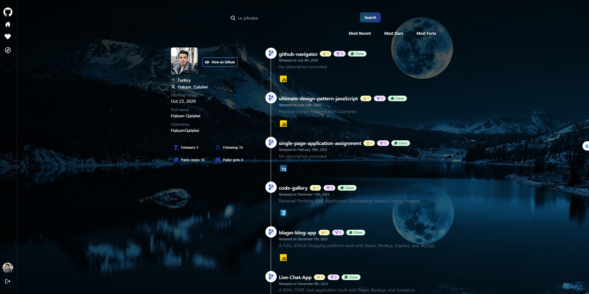

# Repo Radar Application

<p align="center">
  
</p>

> A web application designed to help users discover and explore popular repositories on GitHub


## HOME PAGE

<p align="center">
  
</p>

## LOGIN PAGE

<p align="center">
  
</p>

## EXPLORE PAGE

<p align="center">
  
</p>

## Table of Contents

- [Overview](#overview)
- [Features](#features)
- [Technologies Used](#technologies-used)
- [Prerequisites](#prerequisites)
- [Getting Started](#getting-started)
- [Usage](#usage)
- [Frontend Folder Structure](#frontend-folder-structure)
- [Backend Folder Structure](#backend-folder-structure)

## Overview

GitHub Explorer is a web application designed to help users discover and explore popular repositories on GitHub based on their preferred programming languages. With a user-friendly interface and real-time data fetching, GitHub Explorer makes it easy to find and sort repositories, view detailed user profiles, and keep track of liked profiles.

## Features

- **Explore Popular Repositories**: Browse popular repositories based on different programming languages.
- **User Profiles**: Search for GitHub users and view their profile information and repositories.
- **Liked Repositories**: View the list of repositories liked by the logged-in user.
- **Authentication**: Login and Sign Up using GitHub authentication.

## Technologies Used

- **Frontend**: React, TailwindCSS
- **Backend**: Node.js, Express (assuming there is a backend API)
- **Authentication**: GitHub OAuth
- **State Management:** React Context API
- **Database:** MongoDB

## Prerequisites

- [Node.js and npm](https://nodejs.org/): Make sure you have Node.js and npm installed.

- [MongoDB](https://www.mongodb.com/): Install MongoDB locally or use a cloud-based MongoDB service.

## Getting Started

1. **Clone the repository:**
   ```sh
   git clone <repository-url>
2. **Navigate to the project directory:**
   ```sh
    cd GitHub Navigator
3. **Install backend dependencies:**
   ```sh
    cd backend
    npm install
4. **Install frontend dependencies:**
   ```sh
    cd frontend
    npm install
5. **Create a .env file in the backend directory with the following environment variables:**
   ```sh
    MONGO_URI=<your-mongodb-connection-url>
    GITHUB_API_KEY=<your-github-api-key>
    GITHUB_CLIENT_ID=<your-github-client-url>
    GITHUB_CLIENT_SECRET=<your-github-client-secret-id>
    PORT=5000
    CLIENT_BASE_URL=http://localhost:3000
6. **Start the backend:**
   ```sh
    nodemon
7. **Start the frontend:**
   ```sh
    npm run dev

## Usage

- **Login/Sign Up:** Users can log in or sign up using their GitHub accounts.
- **Explore Repositories:** Click on the language icons to fetch and view popular repositories.
- **Search Profiles:** Use the search bar to find GitHub profiles and view detailed information.
- **Sort Repositories:** Use the sort options to organize repositories by recent, stars, or forks.
- **View Likes:** Check the list of users who have liked your profile.

## Frontend Folder Structure

- public
  - index.html
  - javascript.svg
  - typescript.svg
  - c++.svg
  - python.svg
  - java.svg
  - ...
- src
  - api.js
  - components
    - ProfileInfo.jsx
    - Repos.jsx
    - Search.jsx
    - SortRepos.jsx
    - Spinner.jsx
    - ...
  - pages
    - ExplorePage.jsx
    - HomePage.jsx
    - LikesPage.jsx
    - LoginPage.jsx
    - SignUpPage.jsx
    - ...
  - utils
    - functions.js
    - ...
  - App.js
  - index.js
- .gitignore
- package.json
- README.md
- ...


## Backend Folder Structure

- client
  - public
  - src
    - assets
    - components
      - chat
    - context
    - hooks
    - pages
    - utils
- server
  - controllers
    - authController.js
    - profileController.js
    - repoController.js
    - ...
  - middleware
    - auth.js
    - errorHandler.js
  - models
    - User.js
    - ...
  - routes
    - auth.js
    - profile.js
    - repos.js
    - ...
  - utils
    - githubApi.js
    - logger.js
- .env
- .gitignore
- server.js
- package.json
- README.md


